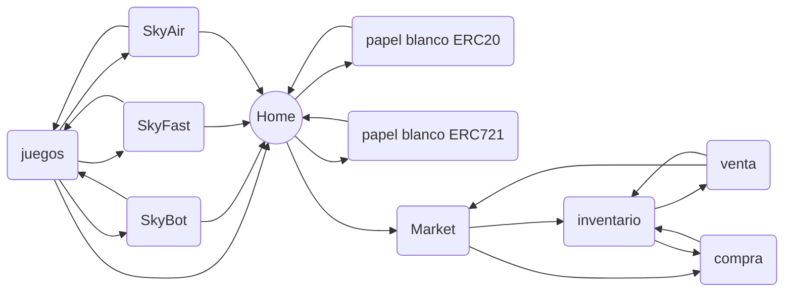

# SkyLight
**SkyLight:** Comprende los papeles blancos del contrato **ERC20 (Skynet)** y del **ERC21 (SkyItem)**, a su ves comprende en uno de sus apartados la tienda de activos, donde el jugador podrá adquirir o vender objetos de tipo **ERC721** o objetos internos de los juegos.
# Juegos:
|Juego|Salida|Items                         |
|-|-|-|
|SkyBot|20-12-2023|45|
|SkyFast|20-12-2024|50|
|SkyAir|20-12-2025|40|
### SkyBot: 
Juego de Guerras de Tiempo Real.
modos de Juego: **1c1MP**
**Server: NodeJS
Cliente: Unity3D
Msgs: Json**
### SkyFast:
Juego de Carreras de Autos.
modos de Juego: **1c4**, **1c9**, **1c14**, **1c19** 
**Server: NodeJS
Cliente: Unity3D
Msgs: Json**
### SkyAir:
Juego de Guerra de Aviones. 
modos de Juego: **1c1**, **2c2**, **5c5**, **10c10**
**Server: NodeJS
Cliente: Unity3D
Msgs: Json**
# Secciones
## Home
Cover de presentacion de SkyLight.
## TOKEN Fungible SkyNet
Papel blanco de Smart Contract **ERC21** Token.
>Total supply : 21000000
## TOKEN No Fungible SkyItem
>Total supply : Mint
## Games
>Seccion de juegos
## Marketplace
>mercado... 
## Nomenclatura Exponencial
Exponencial: $\Gamma(n) = (n-1)!\quad\forall n\in\mathbb N$
$$
\Gamma(z) = \int_0^\infty t^{z-1}e^{-t}dt\,.
$$
## Formula a aplicar en Calculo de juegos.
$$
R(x) = 2^{x}
$$
## Mapa
>genérico
